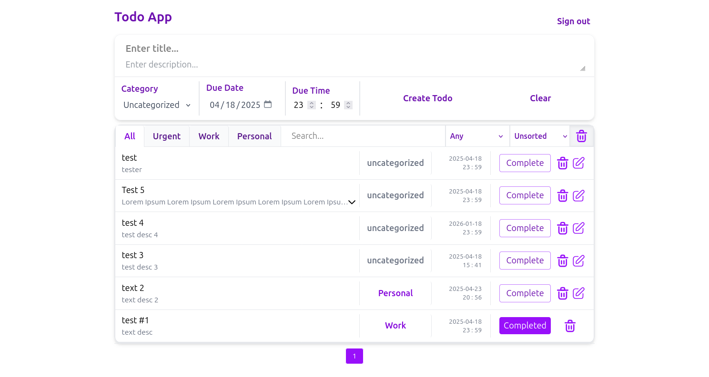

<a id="readme-top"></a>
<br />
<div align="center">
</div>


## Todo Application



### Built With

[![Laravel]][Laravel-url]
[![Vue.js]][Vue-url]
[![tailwindcss]][Tailwind-url]


### Installation
   
1. Install Composer, PHP and NPM

2. Install Composer Packages
   ```sh
   composer install 
   ```
3. Install NPM Packages
   ```sh
   npm i 
   ```
4. Set DB_* env variables to your database

5. Run Migrations
   ```js
   php artisan migrate
   ```
6. Run Server
   ```js
   composer run dev
   ```


## Potential Improvements

1. Use api guard for api: Currently web guard is used for all routes, XSRF protection is not enabled

2. Dynamic categories: Categories are hard-coded instead of having their own controller/model/table

3. Responsiveness for mobile: No media queries, not suitable for small screens

4. More SoC: Currently Todo system is made of 4 component files 
## Contact

Whatsapp: 01228473230<br>
Linkedin: [linkedin.com/in/ahmed-hassan-abozed-6271b223a](https://www.linkedin.com/in/ahmed-hassan-abozed-6271b223a)<br>
Project Link: [github.com/AhmdAbozed/chat-vue-laravel](https://github.com/AhmdAbozed/chat-vue-laravel)<br>

<p align="right">(<a href="#readme-top">back to top</a>)</p>


[Vue.js]: https://img.shields.io/badge/Vue.js-4FC08D?style=for-the-badge&logo=vuedotjs&logoColor=white
[Vue-url]: https://vuejs.org/
[tailwindcss]: https://img.shields.io/badge/Tailwindcss-06B6D4?style=for-the-badge&logo=tailwindcss&logoColor=white
[Tailwind-url]: https://tailwindcss.com/
[Laravel]: https://img.shields.io/badge/Laravel-FF2D20?style=for-the-badge&logo=laravel&logoColor=white
[Laravel-url]: https://laravel.com/
